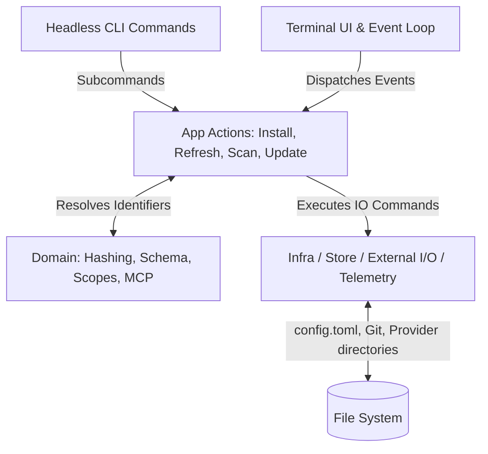

# Technical Architecture — `agk`

**Pluggable Rust TUI for managing agent skills, instructions, providers, and vaults**

## 1. High-Level Goals

- Provide a **single-command TUI** (`agk`) to manage agent skills, instructions, providers, and vault sources.
- Support **multiple vaults attached at the same time** (local, github, etc.).
- Support **multiple AI providers** (Copilot, Claude, Gemini, Letta, Firebender, OpenCode, etc.) allowing for simultaneous selection to broadcast instructions to different AI agent target ecosystems.
- Persist all managed data in a single tool-owned, easily parsed `config.toml`.
- Use **sha10** (file hashing) as the authoritative asset freshness check rather than relying purely on static semantic versions.
- Support both **global** and **workspace-level (local)** scopes for configurations and agent tools.
- Provide a **headless CLI** (`agk sync`, `agk install`, `agk validate`, `agk pack`) for CI/CD pipelines, onboarding scripts, and AI agent automation.
- Support **skill bundling** via meta-skills with recursive dependency installation.
- Support **MCP server management** as a first-class asset type with registration, testing, and per-provider activation.
- Keep the main UI compact, readable, and optimized for rapid terminal workflows using asynchronous UI paradigms.
- Ensure all API calls, network operations, network scans and IO processes run completely asynchronously using `tokio` (i.e. to prevent freezing the UI buffer during remote repo syncs).
- Use **Lightweight Vault Fetching**: GitHub vaults leverage `git --filter=blob:none` and sparse-checkout to fetch relevant tools to a global cache, reducing I/O friction footprint.

## 2. Non-goals

- User hand-editing TOML as a primary workflow.
- Complex package dependency resolution between different agent skills (meta-skills are flat `requires:` lists, not semver graphs).
- Remote multi-user coordination or remote lock state syncing.
- Injecting provider-specific business logic deeply into the core `agk` domain parser.
- Rich GUI beyond the terminal environment bounds.
- Network telemetry or cloud analytics (analytics are strictly local-only).

## 3. Core System Data Flow

`agk` separates logic into decoupled layers representing Data persistence (External I/O / Git / FileSystem / Providers), the Core domain (Models / Identification / Refresh Rules), the Core app operations (Scans / Installs / Updates), and the TUI overlay (Key Events / Rendering / Event loops).



## 4. Rust Module Layout

`agk` separates logic vertically using following structure:

```text
src/
├── main.rs              # Entry point: CLI parse → headless or TUI
├── cli/                 # Command parser and headless command implementations
│   ├── entry.rs         # clap argument definitions
│   ├── commands.rs      # sync, install, validate, pack implementations
│   └── output.rs        # --quiet, --verbose, --json formatting
├── tui/                 # TUI Application loop and rendering logic
│   ├── app.rs           # Core TUI reactive state management
│   ├── event.rs         # Maps keycodes and modes to App Actions
│   ├── layout.rs        # Screen layout calculations
│   ├── render.rs        # Frame drawing orchestration
│   └── widgets/         # TUI Component render layouts
│       ├── list.rs
│       ├── detail.rs
│       ├── status.rs
│       ├── tabs.rs
│       ├── mcp_list.rs      # Tab 4: MCP Servers (NEW)
│       └── mcp_modal.rs     # MCP registration dialog (NEW)
├── app/                 # TUI-agnostic app workflows
│   ├── actions.rs       # Reusable dispatch operations (attach/install/etc)
│   ├── bootstrap.rs     # DI and wiring for configs, registry, and providers
│   ├── bundling.rs      # Meta-skill dependency resolution (NEW)
│   ├── ports.rs         # Trait definitions for dependencies
│   └── registry.rs      # Registry of feature sets, vaults, providers
├── domain/              # Pure domain code
│   ├── asset.rs         # Structure models for Skills, Instructions, MCP
│   ├── config.rs        # TOML configuration schemas
│   ├── hashing.rs       # sha10 computation
│   ├── identity.rs      # AssetIdentity parsing and formatting
│   ├── mcp.rs           # McpServer, McpTransport domain models (NEW)
│   ├── paths.rs         # Canonical path resolution
│   ├── scope.rs         # Global vs Workspace enum
│   └── validation.rs    # Config validation rules
└── infra/               # Infrastructure, I/O, Side-effects
    ├── config/          # TOML store reads/writes and atomic saves
    │   └── toml_store.rs
    ├── feature/         # Feature set scanners (skills, instructions)
    │   ├── skill.rs
    │   ├── instruction.rs
    │   └── stub.rs
    ├── mcp/             # MCP registry, tester, provider config writer (NEW)
    │   ├── registry.rs
    │   ├── tester.rs
    │   └── provider_config.rs
    ├── provider/        # Translators for taking traits and saving to framework-specific dirs
    │   ├── claude_code.rs
    │   ├── github.rs
    │   ├── opencode.rs      # OpenCode provider adapter (NEW)
    │   ├── gemini.rs
    │   ├── letta.rs
    │   ├── snowflake.rs
    │   ├── firebender.rs
    │   ├── amp.rs
    │   └── common.rs
    ├── telemetry/       # Passive log scanning (NEW)
    │   ├── parser.rs
    │   ├── scanner.rs
    │   └── store.rs
    └── vault/           # Interfaces interacting with local disks vs GitHub sparse-clone
        ├── local.rs
        ├── github.rs
        └── clawhub.rs
```

### Module Responsibilities

#### `domain/`
Pure data models and functional business rules that do not touch the filesystem directly. Rules relating to identity generation, object shapes, and logical state definitions.

**Key types:** `AssetKind` (Skill, Instruction, McpServer), `AssetIdentity`, `Scope`, `McpServer`, `McpTransport`.

#### `app/`
Application workflows orchestrating the `infra/` traits. Responsible for taking inputs from the UI state or CLI flags, determining necessary installation paths and update mappings, and pushing the logic downward.

**Key functions:** `install_asset()`, `remove_asset()`, `update_asset()`, `attach_vault()`, `detach_vault()`, `resolve_dependencies()` (meta-skills).

#### `infra/`
Contains the tangible operational work. Connecting to `git` through `std::process`, serializing to TOML files, writing explicitly to provider directories based on `ProviderPort` trait instructions.

**New components:**
- `mcp/`: MCP server registry (`mcp.toml`), JSON-RPC tester, provider-specific config writers.
- `telemetry/`: Passive log parsers for Claude Code and Copilot, background scanner, analytics store.
- `provider/opencode.rs`: OpenCode provider adapter with JSON/JSONC merge logic.

#### `tui/`
The UI entry point using `crossterm` and `ratatui`. Decoupled logic that maintains event channels (`tokio::sync::mpsc::UnboundedSender<AppEvent>`), ensuring that visual progress checks and UI ticks run separately from blocking API/IO calls.

**Tab structure (post-restructure):**
- Tab `0` — Vaults
- Tab `1` — Skills
- Tab `2` — Instructions
- Tab `3` — Providers
- Tab `4` — MCP Servers
- Tab `5` — Analytics (telemetry dashboard)

#### `cli/`
Headless command implementations. Reuses `app/actions.rs` but executes directly without TUI event channels. Supports `--quiet`, `--verbose`, and `--json` output modes.

## 5. Port Traits (Hexagonal Architecture)

The `app/ports.rs` file defines the four core trait boundaries:

| Trait | Purpose | Implementations |
|-------|---------|-----------------|
| `FeatureSetPort` | Scans a package type (skills vs instructions) | `SkillFeatureSet`, `InstructionFeatureSet` |
| `VaultPort` | Vault source abstraction | `LocalVaultAdapter`, `GithubVaultAdapter`, `ClawHubVaultAdapter` |
| `ProviderPort` | Target AI platform installer | `ClaudeCodeProvider`, `GithubProvider`, `OpenCodeProvider`, `GeminiProvider`, etc. |
| `ConfigStorePort` | Scoped config persistence | `TomlConfigStore` |

**New traits (added for MCP):**
- `McpProvider` (optional extension of `ProviderPort`): Writes MCP server config to provider-specific JSON files.

## 6. Key Patterns

- **SHA10 hashing** for asset change detection, not semantic versions. Version is display metadata; sha10 is the source of truth for freshness.
- **Scoped config**: Global (`~/.config/agk/config.toml`) for vaults/providers, Workspace (`.agk/config.toml`) for installed assets.
- **Async I/O**: All network/git operations run on tokio tasks via `AppEvent` channel to keep TUI responsive. Never block the render loop.
- **Bootstrap is the only DI point**: `app/bootstrap.rs` wires infra adapters. No infra imports outside this file and `main.rs`.
- **Headless CLI is the public API**: All installation logic is pure async functions in `app/actions.rs`, callable from both TUI and CLI.

## 7. Configuration Files

| File | Purpose |
|------|---------|
| `~/.config/agk/config.toml` | Global config: vaults, providers, installed global assets |
| `.agk/config.toml` | Workspace config: installed workspace assets |
| `~/.config/agk/mcp.toml` | MCP server registry (NEW) |
| `~/.config/agk/analytics.toml` | Telemetry data (NEW, opt-in, local-only) |

---

*End of Architecture Document.*
