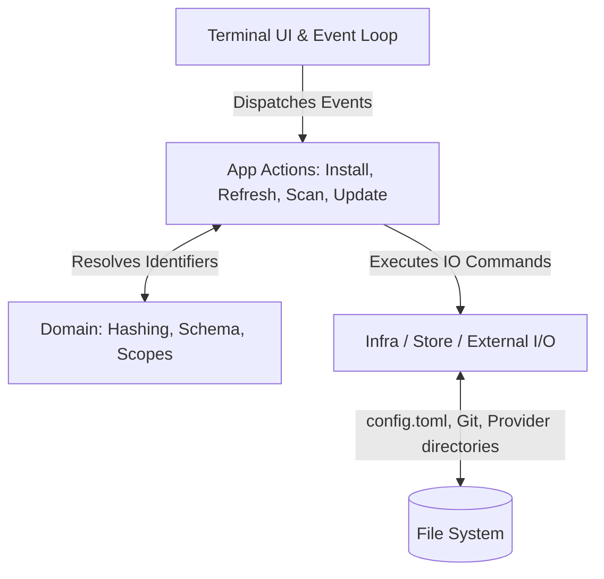

# Technical Architecture — `agk`

**Pluggable Rust TUI for managing agent skills, instructions, providers, and vaults**

## 1. High-Level Goals

- Provide a **single-command TUI** (`agk`) to manage agent skills, instructions, providers, and vault sources.
- Support **multiple vaults attached at the same time** (local, github, etc.).
- Support **multiple AI providers** (Copilot, Claude, Gemini, Letta, Firebender, etc.) allowing for simultaneous selection to broadcast instructions to different AI agent target ecosystems.
- Persist all managed data in a single tool-owned, easily parsed `config.toml`.
- Use **sha10** (file hashing) as the authoritative asset freshness check rather than relying purely on static semantic versions.
- Support both **global** and **workspace-level (local)** scopes for configurations and agent tools.
- Keep the main UI compact, readable, and optimized for rapid terminal workflows using asynchronous UI paradigms.
- Ensure all API calls, network operations, network scans and IO processes run completely asynchronously using `tokio` (i.e. to prevent freezing the UI buffer during remote repo syncs).
- Use **Lightweight Vault Fetching**: GitHub vaults leverage `git --filter=blob:none` and sparse-checkout to fetch relevant tools to a global cache, reducing I/O friction footprint.

## 2. Non-goals

- User hand-editing TOML as a primary workflow.
- Complex package dependency resolution between different agent skills.
- Remote multi-user coordination or remote lock state syncing.
- Injecting provider-specific business logic deeply into the core `agk` domain parser.
- Rich GUI beyond the terminal environment bounds.

## 3. Core System Data Flow

`agk` separates logic into decoupled layers representing Data persistence (External I/O / Git / FileSystem / Providers), the Core domain (Models / Identification / Refresh Rules), the Core app operations (Scans / Installs / Updates), and the TUI overlay (Key Events / Rendering / Event loops).



## 4. Rust Module Layout

`agk` separates logic vertically using following structure:

```text
src/
├── main.rs
├── cli/                 # Top level command parser options
├── tui/                 # TUI Application loop and rendering logic
│   ├── app.rs           # Core TUI reactive state management
│   ├── event.rs         # Maps keycodes and modes to App Actions
│   └── widgets/         # TUI Component render layouts
├── app/                 # TUI-agnostic app workflows
│   ├── actions.rs       # Reusable dispatch operations (attach/install/etc)
│   ├── bootstrap.rs     # DI and wiring for configs, registry, and providers
│   └── ports.rs         # Trait definitions for dependencies
├── domain/              # Pure domain code
│   ├── asset.rs         # Structure models for Skills and Instructions
│   ├── config.rs        # TOML configuration schemas
│   └── scope.rs         # `Global` vs `Workspace` enum rules
└── infra/               # Infrastructure, I/O, Side-effects
    ├── config/          # TOML store reads/writes and atomic saves
    ├── provider/        # Translators for taking traits and saving to framework-specific dirs
    └── vault/           # Interfaces interacting with local disks vs GitHub sparse-clone operations
```

### Module Responsibilities

#### `domain/`
Pure data models and functional business rules that do not touch the filesystem directly. Rules relating to identity generation, object shapes, and logical state definitions.

#### `app/`
Application workflows orchestrating the `infra/` traits. Responsible for taking inputs from the UI state or CLI flags, determining necessary installation paths and update mappings, and pushing the logic downward. 

#### `infra/`
Contains the tangible operational work. Connecting to `git` through `std::process`, serializing to TOML files, writing explicitly to `~/.copilot/skills/` or `~/.claude/` based on `ProviderPort` trait instructions.

#### `tui/`
The UI entry point using `crossterm` and `ratatui`. Decoupled logic that maintains event channels (`tokio::sync::mpsc::UnboundedSender<AppEvent>`), ensuring that visual progress checks and UI ticks run separately from blocking API/IO calls using heavy Task Pools spawned within `action.rs`.
