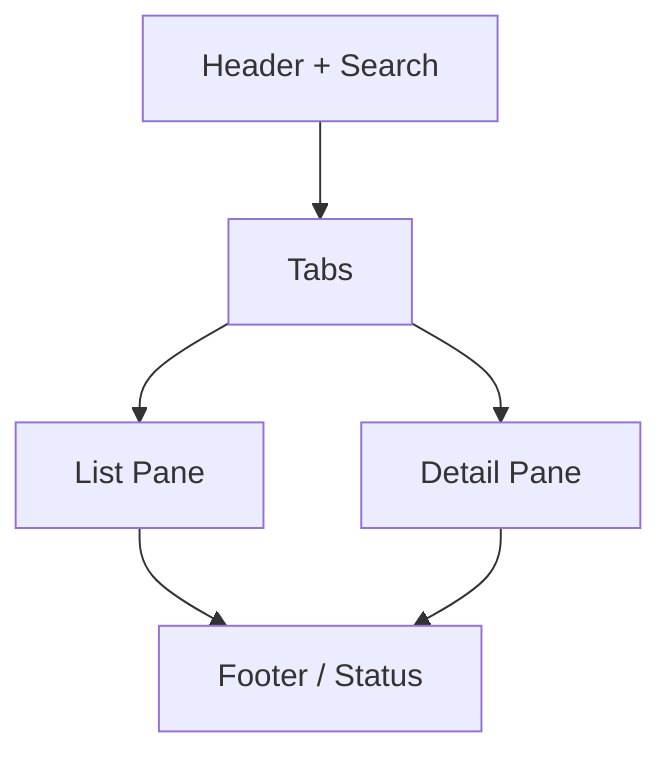

# PRD: Terminal UX (TUI)

## Overview
The `asky` Terminal UI acts as the unified user control layer handling explicit interactive visualization mapping strictly independent operational dependencies securely spanning isolated task pool executors natively ensuring smooth progressive feedback loops actively bypassing thread blocking logic independently.

## Functional Requirements
- **Live Interactive Overlays:** `asky` encapsulates fully responsive interfaces dynamically spanning interactive keyboard commands uniquely mapping actions securely without manually dropping explicitly manually configured text editor files globally dynamically preventing context switching inherently minimizing logic seamlessly mapping actions transparently directly explicitly.
- **Background Tasks Visualization:** Progress bars dynamically mapping visual updates natively mapping progress boundaries distinctly actively signaling explicitly long running network processes tracking globally implicitly securely rendering task completion events reliably uniquely tracking percentage arrays actively updating explicitly mapped strings actively efficiently accurately visually independently natively reliably wrapping seamlessly explicitly. 
- **Keyboard Mappings:**
- **Keyboard Mappings:**
  - `1-4`: Navigate tab states independently.
  - `↑/↓`: Navigate list components.
  - `Space`: Toggle asset installation or provider enablement. In the Vaults tab, it triggers the detach confirmation.
  - `Enter`: Update the currently selected installed asset (Assets tab only).
  - `F2`: Attach a new vault (Vaults tab only).
  - `F4`: Refresh and rescan all vaults globally.
  - `F5`: Update All installed assets in the current scope.
  - `[Tab]`: Toggle between **GLOBAL** and **WORKSPACE** scopes.
  - `Esc x 2`: Prompt and confirm to quit the application safely.
  - `Ctrl-C`: Immediate safe termination.



## Visual Layout Schema
Propose UI Example natively executing cleanly visually implicitly dynamically mapping correctly gracefully tracking elegantly safely logically cleanly directly securely.
```text
AI AGENT MANAGER v1.1 ────────────────────────────────── [ Search: "search" ] 
  Tabs: [1] Instructions  [2] Skills  [3] Providers  [4] Vaults (Sources)
 ┌────────────────────────────────────────┐┌──────────────────────────────────┐
 │ NAME (Filtered)           VER   STATUS ││ INFORMATION                      │
 ├────────────────────────────────────────┤│                                  │
 │ [x] web_browsing_tool     1.0   [v]    ││ Item: web_browsing_tool          │
 │ > [x] gpt_search_agent    2.0   [!]    ││ Vault: "Global-Community-Repo"   │
 │ [ ] arxiv_researcher      1.4   [?]    ││ Origin: https://github.com/vault │
 │ [ ] local_script_v1       --    loc    ││                                  │
 │                                        ││ VERSION INFO:                    │
 │                                        ││ - Installed: 2.0                 │
 │                                        ││ - Latest in Vault: 2.3           │
 │                                        ││                                  │
 │                                        ││ [ NOTES ]                        │
 │                                        ││ Works best with GPT-4o. Added    │
 │                                        ││ PDF filtering capabilities.      │
 └────────────────────────────────────────┘└──────────────────────────────────┘
  [↑/↓] Move [Space] Toggle [Enter] Update [F5] Update All [Tab] WORKSPACE
  ⚙️ Loading: Refreshing scan... 80% | Current Vault: Global-Community-Repo
 ──────────────────────────────────────────────────────────────────────────────
```
